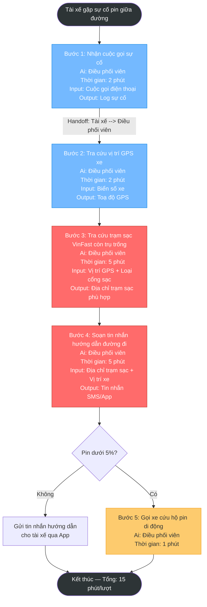
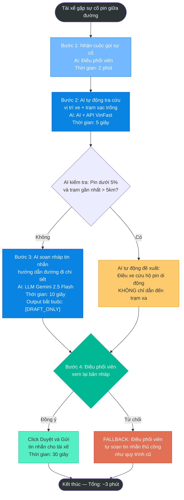
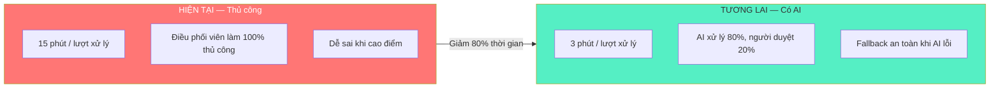

# 04 — Workflow Diagram: Xanh SM Xử Lý Sự Cố Pin Tài Xế

> **Bài toán:** Tài xế Xanh SM báo sự cố pin giữa đường, điều phối viên phải tìm trạm sạc phù hợp

---

## Sơ đồ 1: Current-State Workflow (Quy trình hiện tại — Thủ công)

**Chú thích:**
- Đỏ = BOTTLENECK (bước tốn thời gian nhất)
- Xanh = Bước bình thường
- Vàng = Bước có điều kiện

---

## Sơ đồ 2: Future-State Workflow (Quy trình tương lai — Có AI hỗ trợ)

**Chú thích:**
- Xanh đậm = AI Step (tác vụ AI xử lý tự động)
- Xanh lá = HUMAN Step (con người phê duyệt — Human-in-the-loop)
- Vàng = Fallback pin dưới 5%
- Đỏ = Fallback khi AI lỗi

---

## So sánh hiệu suất

